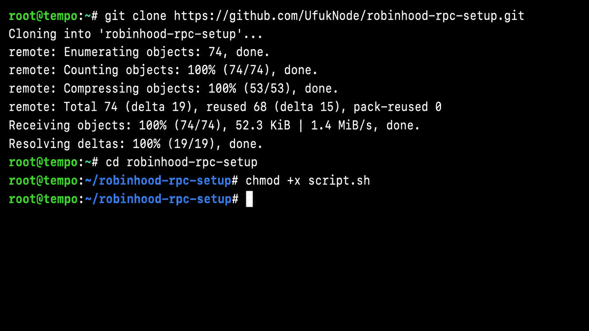
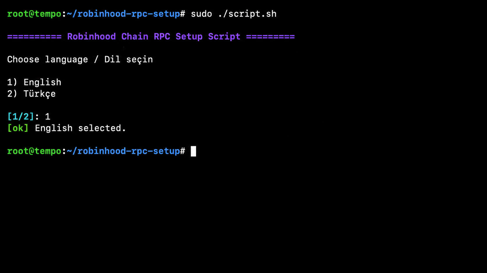
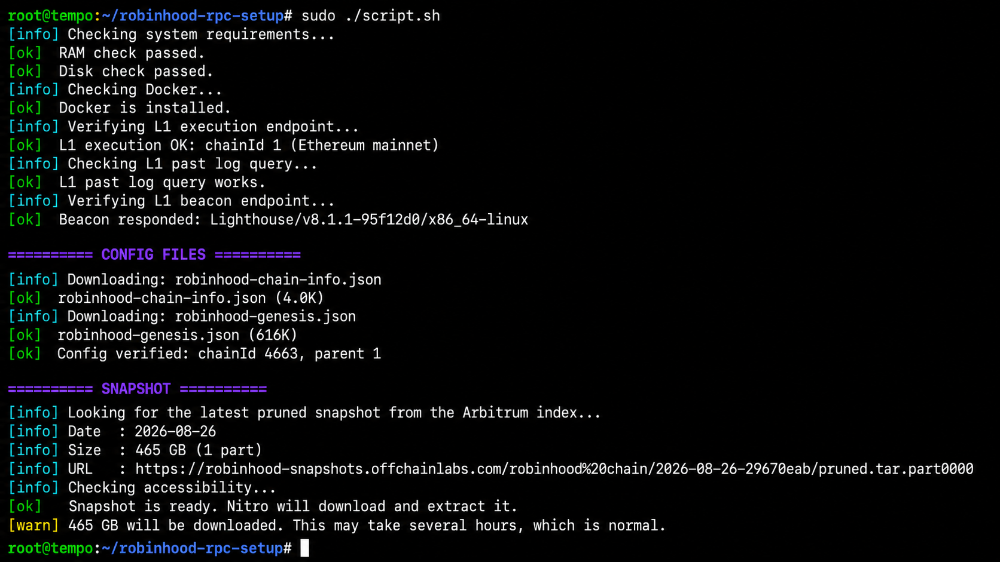
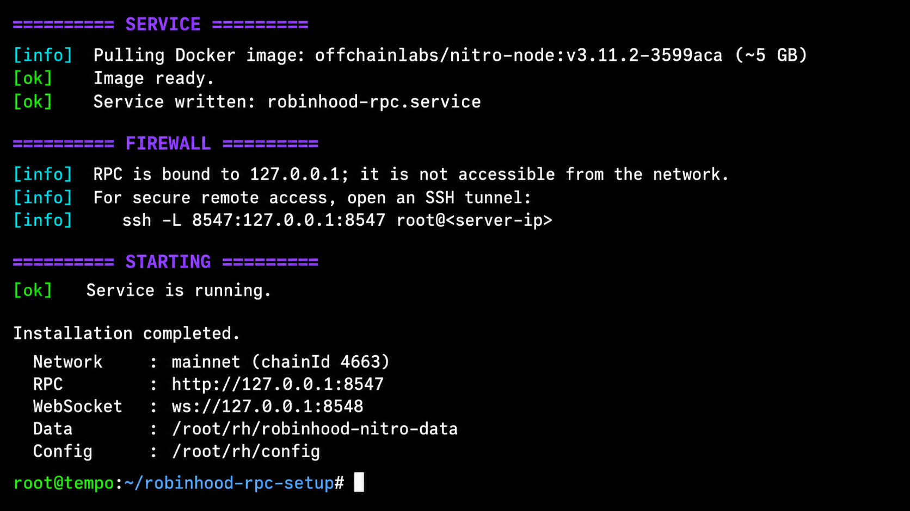
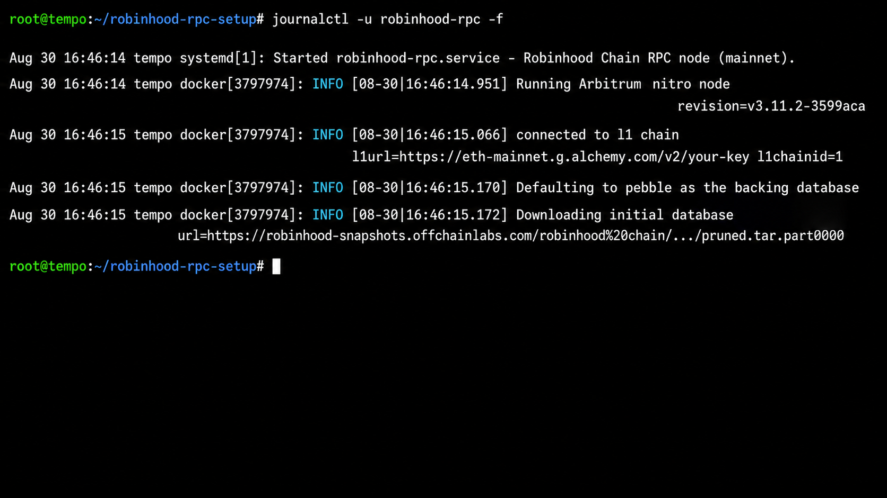
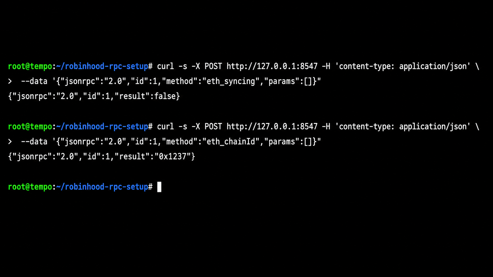

# Robinhood Chain RPC Node Setup Guide

Turkish guide: [TR-Rehber.md](TR-Rehber.md)

This guide helps you install your own Robinhood Chain RPC node on an Ubuntu server with one script.
You answer a few questions and the script handles the checks, official files, snapshot download and
system service for you.

You only need a suitable server and two Ethereum provider URLs. The sections below explain where to
get them and how to use your RPC after synchronization.

In simple terms, an RPC is the connection your wallet, bot or app uses to talk to Robinhood Chain.
With this setup, that connection runs on your own server instead of a shared public RPC.

---

## Overview

| Property | Value |
| --- | --- |
| Network | Robinhood Chain Mainnet |
| Chain ID | 4663 |
| Official documentation | https://docs.robinhood.com/chain/run-a-full-node/ |
| Public RPC | https://rpc.mainnet.chain.robinhood.com |
| Explorer | https://robinhoodchain.blockscout.com |

---

## System Requirements

| Requirement | Details |
| --- | --- |
| RAM | 64 GB minimum, 128 GB recommended |
| Storage | Several TB of local NVMe; 4 TB or more recommended |
| Operating system | Ubuntu 22.04 or 24.04 |
| Docker | Installed automatically when missing |
| Ethereum L1 | One execution RPC and one beacon endpoint; both are required |

The script automatically finds the latest completed snapshot and shows its size before installation.
A snapshot is a ready-made copy of the blockchain data. The download is hundreds of gigabytes, but
the completed database is much larger. Use several terabytes of NVMe storage and keep extra free
space while the snapshot is being opened.

---

## Ethereum L1 Connection

Before starting, get these two **Ethereum Mainnet** URLs from an RPC provider:

1. **Execution RPC URL**
2. **Beacon RPC URL**

These are Ethereum URLs, not Robinhood RPC URLs. The setup script asks for both and checks them
before downloading the snapshot.

Alchemy is one provider that offers both services. After creating an Ethereum Mainnet app, the URLs
usually look like this:

```text
Execution: https://eth-mainnet.g.alchemy.com/v2/YOUR_KEY
Beacon:    https://eth-mainnetbeacon.g.alchemy.com/v2/YOUR_KEY
```

Replace `YOUR_KEY` with your own key. Initial synchronization makes many requests, so a free plan
may run out of quota. Make sure your plan supports historical Ethereum data.

Do not share your API key. Nitro may include the execution URL in its logs, so hide the key before
sharing screenshots and rotate it immediately if it is exposed.

<details>
<summary>Why are two Ethereum URLs required?</summary>

Robinhood Chain stores part of its data on Ethereum. The execution URL provides normal Ethereum
data, while the beacon URL provides blob data. The node needs both to rebuild and verify the chain.
The script also checks that the execution provider accepts an older `eth_getLogs` request. Basic
beacon connectivity cannot prove that every historical blob is available, so confirm historical
blob support with your provider.

</details>

---

## Choosing a Server

Do not choose a server only by provider name. Check the actual package:

- Modern CPU with at least 8 cores
- 64 GB RAM minimum; 128 GB recommended
- Several terabytes of local NVMe storage; 4 TB or more is a safer starting point
- Ubuntu 22.04 or 24.04

Do not use an HDD or slow network storage. The snapshot and extracted database temporarily use disk
space at the same time, so a server that can only fit the download file is not enough.

---

## 1. Connect to the Server

```bash
ssh root@[SERVER_IP]
```

Replace `[SERVER_IP]` with the IP address of your server.

Windows users can first follow this WSL installation guide:
https://x.com/UfukDegen/status/1944066889346429338

---

## 2. Download the Script

```bash
git clone https://github.com/UfukNode/robinhood-rpc-setup.git
cd robinhood-rpc-setup
chmod +x script.sh
```



---

## 3. Start the Installation

```bash
sudo ./script.sh
```

---

## 4. Language and Installation Options

The script first asks you to choose a language. All subsequent prompts and help messages use the
selected language.



The script then:

- Checks RAM and disk capacity and warns when they are insufficient.
- Installs Docker when it is missing.
- Checks the two Ethereum provider URLs.
- Downloads and verifies the official Robinhood network files.
- Finds and verifies the latest completed snapshot.
- Installs and starts the Robinhood RPC service.



Snapshot sizes change over time. The script prints the current size before starting. Nitro performs
the actual download, which can take several hours.

When setup finishes, the service, firewall and local RPC details are shown together:



---

## 5. Follow the Logs

```bash
journalctl -u robinhood-rpc -f
```

The log shows whether the node started and whether the snapshot download is progressing:



The first download can take hours. While `transferred ... bytes` keeps increasing, the node is still
working. Port `8547` may not answer until the snapshot is downloaded and extracted. This is normal.

---

## 6. Check Synchronization

Run this command on the RPC server:

```bash
curl -s -X POST http://127.0.0.1:8547 -H 'content-type: application/json' \
  --data '{"jsonrpc":"2.0","id":1,"method":"eth_syncing","params":[]}'
```

If the command does not answer yet, the snapshot is still being prepared. Try again later.
Synchronization is complete when the result is `false`. Then confirm the network:

```bash
curl -s -X POST http://127.0.0.1:8547 -H 'content-type: application/json' \
  --data '{"jsonrpc":"2.0","id":1,"method":"eth_chainId","params":[]}'
```

Example verification after synchronization completes:



`0x1237` is hexadecimal for **4663**, the Robinhood Chain ID. A different result means the node is
using the wrong configuration.

You can follow the latest blocks at https://robinhoodchain.blockscout.com.

---

## 7. Use the RPC

After synchronization, your RPC is ready. How you connect depends on where your wallet, bot or app
is running.

### Option A: Your app runs on the RPC server

Use these addresses directly in the app running on that same server:

```text
HTTP       : http://127.0.0.1:8547
WebSocket  : ws://127.0.0.1:8548
```

No SSH tunnel is needed in this case.

### Option B: Connect from your own computer

Run the following command **on your own computer**, not on the RPC server. Replace `[SERVER_IP]`
with the IP address of the server:

```bash
ssh -N -L 8547:127.0.0.1:8547 -L 8548:127.0.0.1:8548 root@[SERVER_IP]
```

Enter the server password when asked and keep this terminal window open. This creates a private SSH
tunnel. Programs on your computer can now use:

```text
HTTP       : http://127.0.0.1:8547
WebSocket  : ws://127.0.0.1:8548
```

Opening `127.0.0.1` to the whole internet is not required.

### Add the RPC to MetaMask or another wallet

Keep the SSH tunnel open, then add a custom network with these values:

```text
Network name : Robinhood Chain
RPC URL      : http://127.0.0.1:8547
Chain ID     : 4663
Currency     : ETH
Explorer     : https://robinhoodchain.blockscout.com
```

Test the connection from a second terminal on your computer:

```bash
curl -s -X POST http://127.0.0.1:8547 -H 'content-type: application/json' \
  --data '{"jsonrpc":"2.0","id":1,"method":"eth_chainId","params":[]}'
```

A working Robinhood RPC returns `0x1237`, which is chain ID 4663.

### Option C: Allow another server to connect

This is an advanced option. Use it only when the other server has a fixed IP address. During setup,
run:


```bash
sudo ./script.sh --expose-rpc yes --allowed-ip [YOUR_IP] \
  --l1-rpc [L1_RPC_URL] --l1-beacon [BEACON_URL]
```

Replace `[YOUR_IP]` with the public IP of the computer or server that will use the RPC. Do not run
`--expose-rpc yes` without `--allowed-ip`. A public production RPC also needs TLS, authentication and
rate limiting through a reverse proxy such as Nginx or Caddy.

---

## Commands

| Command | Description |
| --- | --- |
| `journalctl -u robinhood-rpc -f` | Follow live logs |
| `systemctl status robinhood-rpc` | Show service status |
| `systemctl stop robinhood-rpc` | Stop the node |
| `systemctl start robinhood-rpc` | Start the node |
| `systemctl restart robinhood-rpc` | Restart the node |
| `sudo ./script.sh --uninstall` | Remove service and configuration; preserve chain data |
| `sudo ./script.sh --help` | Show every script option |

---

## Script Options

<details>
<summary>Show advanced script options</summary>

| Option | Purpose |
| --- | --- |
| `--lang tr\|en` | Interface language; prompts when omitted |
| `--network mainnet\|testnet` | Network to install; defaults to mainnet |
| `--l1-rpc <url>` | Required Ethereum execution RPC endpoint |
| `--l1-beacon <url>` | Required Ethereum beacon endpoint |
| `--dry-run` | Run checks without installing Docker or the node service |
| `--expose-rpc yes` | Bind RPC to the network |
| `--allowed-ip <ip>` | Allow only this IP when RPC is exposed |
| `--rpc-port <port>` | Change HTTP port; defaults to 8547 |
| `--ws-port <port>` | Change WebSocket port; defaults to 8548 |
| `--data-dir <path>` | Data and configuration root; defaults to `/root/rh` |
| `--snapshot-type <type>` | `pruned`, `full-path` or `archive-path`; safely stops on multipart snapshots |
| `--forwarding-target <url>` | Transaction forwarding target; defaults to the official sequencer. Use `null` for read-only |
| `--no-snapshot` | Sync from genesis without a snapshot; takes much longer |
| `--non-interactive` | Disable prompts |
| `--uninstall` | Remove the service and configuration without deleting chain data |

</details>

---

## Recommendations

- Run `sudo ./script.sh --dry-run` first. It checks the server and URLs without installing the node.
- Use NVMe storage with plenty of free space.
- Do not expose RPC to the whole internet. Use the SSH tunnel shown above.
- Avoid free Ethereum provider URLs because initial synchronization uses many requests.
- For Testnet, use Sepolia execution and beacon URLs instead of Ethereum Mainnet URLs.

---

## Troubleshooting

<details>
<summary>Open common errors and solutions</summary>

**"The L1 execution URL did not answer"**

The URL may be incorrect, the provider may be unavailable, or the key may be invalid:

```bash
curl -s -X POST [L1_RPC_URL] -H 'content-type: application/json' \
  --data '{"jsonrpc":"2.0","id":1,"method":"eth_chainId","params":[]}'
```

**"Wrong L1: that URL returned chainId ..."**

Mainnet requires Ethereum Mainnet endpoints. Testnet requires Sepolia endpoints.

**"The L1 beacon URL did not answer"**

Your provider may not expose the Beacon API:

```bash
curl -s [BEACON_URL]/eth/v1/node/version
```

**"Archive requests require a personal token" or a similar 403 response**

The execution provider is blocking historical log requests. This does not necessarily mean you
must run an Ethereum archive-state node; the provider must allow historical `eth_getLogs`. Test the
Robinhood Mainnet Rollup deployment block with:

```bash
curl -s -X POST [L1_RPC_URL] -H 'content-type: application/json' \
  --data '{"jsonrpc":"2.0","id":1,"method":"eth_getLogs","params":[{"address":"0x23A19d23e89166adedbDcB432518AB01e4272D94","fromBlock":"0x17d61be","toBlock":"0x17d61be"}]}'
```

**"ForwardingTarget not set and not sequencer"**

The script supplies the required flag automatically. The command in the official guide omits it,
but the tested image does not start without a forwarding target. For a manual setup, add:

```text
--execution.forwarding-target=https://sequencer.mainnet.chain.robinhood.com
```

**"no space left on device"**

The snapshot is hundreds of gigabytes while compressed, and the archive and extracted database
coexist during import. Check `df -h` and follow Nitro's disk-capacity formula instead of relying only
on the compressed download size.

**"stream error: INTERNAL_ERROR" or "attempt 1 failed: unexpected EOF"**

Both messages indicate that the snapshot CDN closed a long transfer. Nitro's downloader supports
HTTP Range requests and resumes from the existing file. The error alone does not mean data loss if
the file continues to grow.

The script sets `GODEBUG=http2client=0` so Nitro downloads the snapshot over HTTP/1.1. It also uses a
persistent `snapshot-download` directory outside the database. A service restart resumes from the
same byte. After import succeeds and RPC responds, the `robinhood-rpc-snapshot-cleanup` service
removes the downloaded archive.

Monitor the file size with:

```bash
watch -n 10 'du -h /root/rh/robinhood-nitro-data/snapshot-download/'
```

**"found unexpected files in database directory, including: tmp"**

An older script version downloaded the snapshot into Nitro's database `tmp` directory. If the
service stopped during download, that directory blocked the next startup. The current script uses a
separate persistent `snapshot-download` directory, so new installations do not create this failure.

**Logs show `/home/user/.arbitrum/...`**

This is expected. Although the Robinhood documentation uses `/home/nitro`, the pinned
`v3.11.2-3599aca` image was verified to run as `uid=1000(user)` with `HOME=/home/user`; the image does
not contain `/home/nitro`. The script mounts the host data directory at `/home/user/.arbitrum` and
grants UID 1000 write access. Using the old mount path placed data in Docker's temporary layer, which
was lost with the container.

**The service keeps restarting**

```bash
journalctl -u robinhood-rpc -n 100 --no-pager
```

The most common causes are an unavailable L1 endpoint or a full disk.

</details>

---

Source: [Official Robinhood Chain documentation](https://docs.robinhood.com/chain/run-a-full-node/)

Author: [@UfukDegen](https://x.com/UfukDegen)
