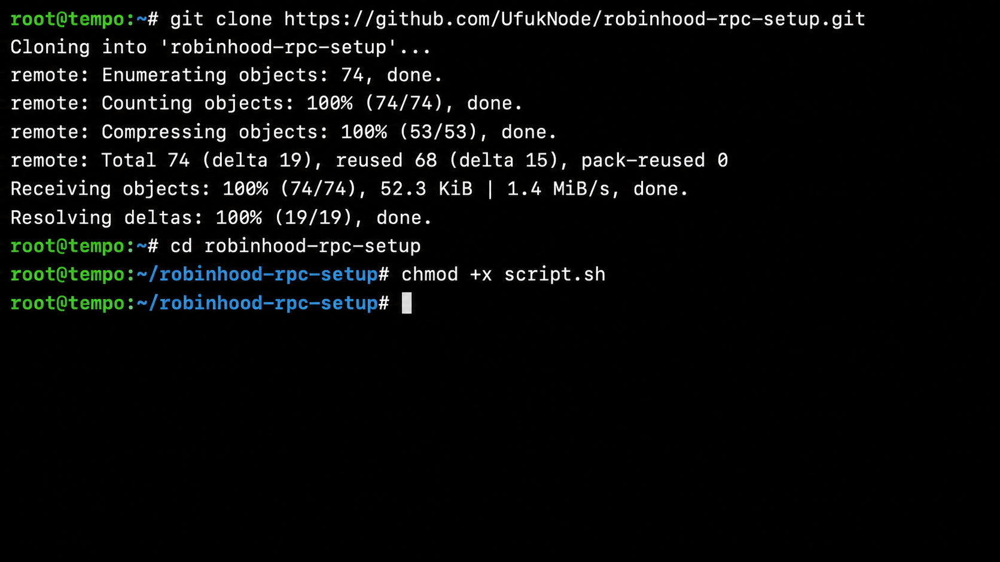
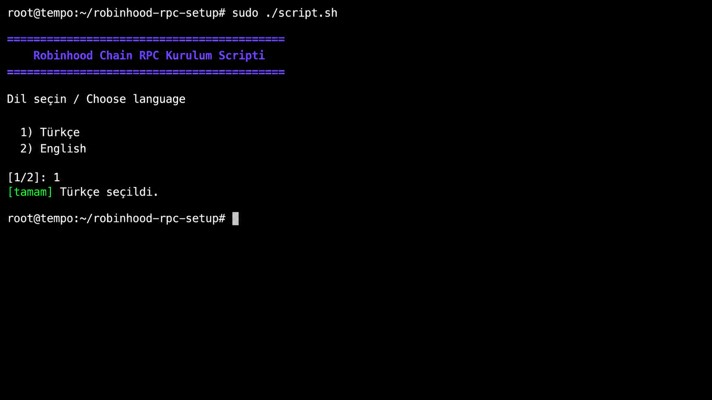
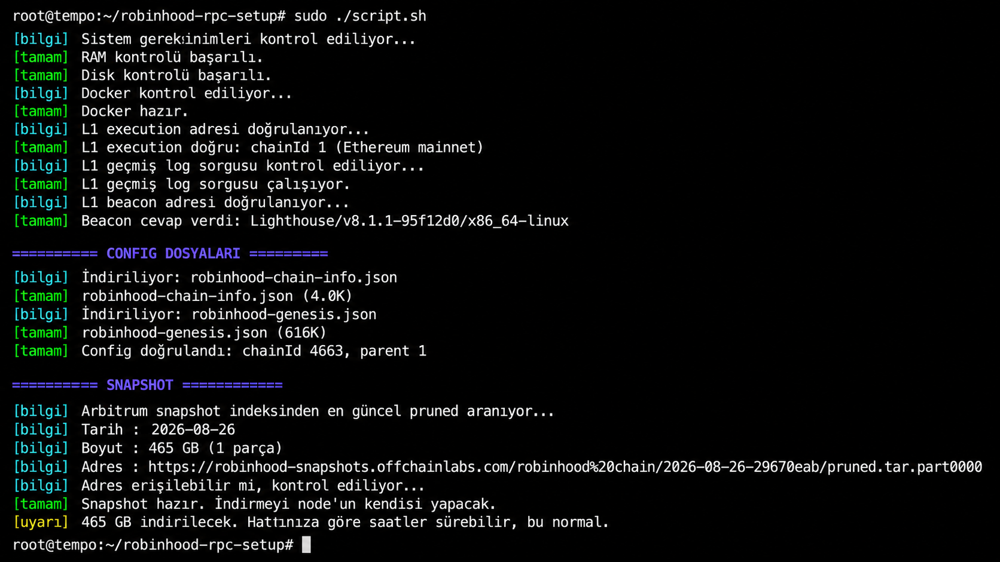
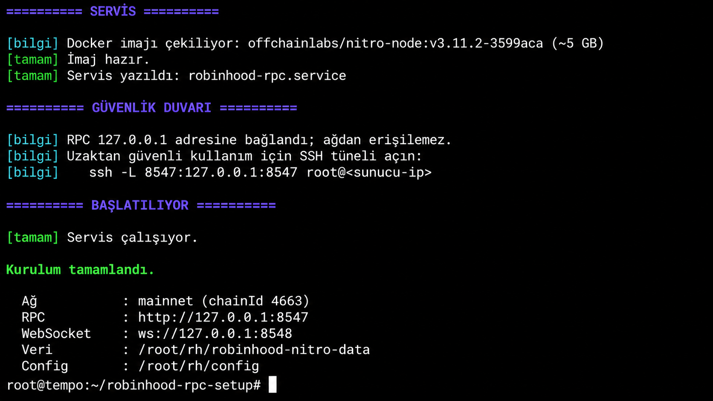
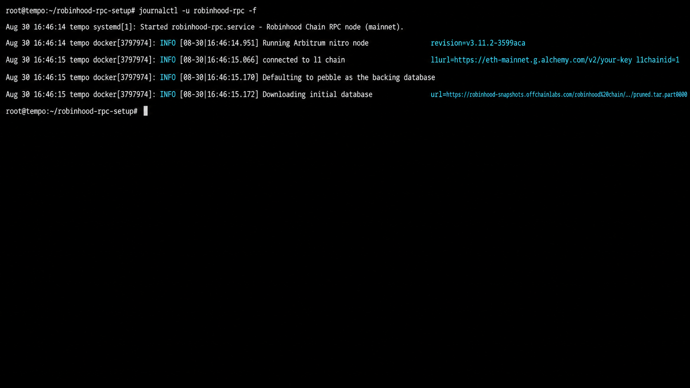
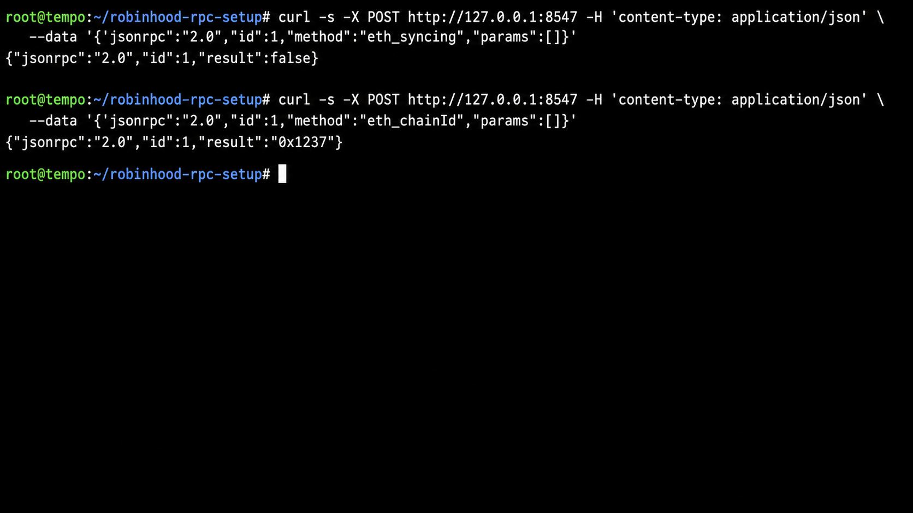

# Robinhood Chain RPC Node Kurulum Rehberi

English guide: [README.md](README.md)

Bu rehber, Robinhood Chain üzerinde kendi RPC node'unuzu kurmanız için hazırlandı. Config dosyaları
Robinhood'un CDN'inden, Docker imajı resmi dokümanda sabitlenen sürümden, snapshot bilgisi ise
Arbitrum'un snapshot indeksinden alınır. Script indirdiği config'in chain ID, parent chain ve Rollup
adresini; snapshot'ın da durumunu, URL'sini ve SHA-256 checksum'unu başlamadan önce kontrol eder.

Yanındaki `script.sh` bütün adımları tek komutta yapar; seçtiğiniz ağ ve verdiğiniz L1 adresleriyle
kurulumu sırayla ilerletir.

---

## Genel Bilgiler

| Özellik            | Açıklama                                                     |
| ------------------ | ------------------------------------------------------------ |
| Ağ                 | Robinhood Chain (mainnet)                                     |
| Chain ID           | 4663                                                          |
| Tür                | Arbitrum Nitro L2, Ethereum üzerine yazar                     |
| Resmi doküman      | https://docs.robinhood.com/chain/run-a-full-node/             |
| Public RPC         | https://rpc.mainnet.chain.robinhood.com                        |
| Explorer           | https://robinhoodchain.blockscout.com                          |

---

## Sistem Gereksinimleri

| Gereksinim         | Detaylar                                                              |
| ------------------ | --------------------------------------------------------------------- |
| RAM                | En az 64 GB, önerilen 128 GB                                          |
| Disk               | Yerel NVMe; güncel zincir boyutunun 2 katı + %20 boş alan             |
| İşletim Sistemi    | Ubuntu 22.04 veya 24.04                                                |
| Docker             | Kurulu değilse script kendisi kurar                                   |
| Ethereum L1        | Bir execution RPC **ve** bir beacon adresi. İkisi de zorunlu          |
| L1 geçmiş verisi   | Execution `eth_getLogs`, beacon geçmiş blob verisini sunabilmeli      |

31 Ağustos 2026 tarihinde Arbitrum indeksinde tamamlanmış en yeni `pruned` snapshot'lar:

| Ağ       | Tarih      | İndirme boyutu |
| -------- | ---------- | --------------- |
| Mainnet  | 2026-08-26 | 466 GB          |
| Testnet  | 2026-08-28 | 233 GB          |

Bu boyutlar sıkıştırılmış indirme dosyasıdır, diskte oluşacak veritabanının kesin boyutu değildir.
Resmi doküman birkaç TB kapasiteyi ve `(2 x güncel zincir boyutu) + %20` boş alanı ister. Tam sınırda
disk almayın. Normal RPC kullanımı için varsayılan `pruned` yeterlidir; geçmiş blok state'i gereken
işlerde archive node gerekir ve Robinhood dokümanı archive node'un sıfırdan senkronlanacağını söyler.

---

## Ethereum L1 Bağlantısı

Bu adımı en başa koyuyorum çünkü kurulumun asıl maliyeti burada ve çoğu rehber bunu atlıyor.

Robinhood Chain verisini Ethereum'a **blob** olarak yazar. Node'un bu veriyi okuyabilmesi için
iki ayrı adres gerekir:

1. **L1 execution RPC**, sıradan bir Ethereum RPC adresi.
2. **L1 beacon RPC**, blob verisi sadece burada durur, execution tarafında yoktur.

Kendi Ethereum node'unuz varsa ikisi de sizde vardır. Yoksa bir sağlayıcıdan alacaksınız.
Beacon adresi vermeyen sağlayıcılar var, aldığınızın verdiğinden emin olun.

Bir şey daha: execution adresiniz Robinhood Rollup kontratının eski L1 bloklarında `eth_getLogs`
sorgusuna cevap verebilmeli. Bunun için mutlaka kendi Ethereum archive-state node'unuzu çalıştırmanız
gerekmez; fakat kullandığınız RPC sağlayıcısı geçmiş log sorgularını kısıtlamamalıdır. Gerçek kurulumda
şu sağlayıcı hatası görüldü:

```
ERROR error initializing database
err="failed getting delayed messages ...: 403 Forbidden:
     Archive requests require a personal token"
```

Script başlamadan önce L1 chain ID'yi, Rollup'ın kurulduğu blokta geçmiş log sorgusunu ve beacon
API'nin temel erişimini kontrol eder. Beacon'ın eski blob verisini gerçekten tuttuğunu yalnızca
`/eth/v1/node/version` testi kanıtlamaz; sağlayıcı planınızda historical blob desteğini ayrıca doğrulayın.

İkisini birden tek yerden almak isterseniz **Alchemy** hem RPC hem beacon adresi veriyor:
https://www.alchemy.com/rpc/ethereum

Ücretsiz public RPC adreslerinin kota ve geçmiş veri politikası habersiz değişebilir. İlk senkron çok
fazla L1 isteği üretir; bu nedenle rehber sabit bir ücretsiz endpoint önermiyor. Kendi senkronize
Ethereum execution + beacon node'unuzu veya historical logs ve historical blobs sunduğunu açıkça
belirten anahtarlı bir sağlayıcıyı kullanın.

Nitro bağlantı kurarken execution URL'sini INFO loguna yazabilir. URL içinde API anahtarı varsa
`journalctl` çıktısında da görünür. Anahtarı IP/kota ile kısıtlayın, log ekran görüntüsünü paylaşmayın
ve yanlışlıkla paylaşılan anahtarı sağlayıcı panelinden hemen yenileyin.

---

## Sunucu Seçimi

Sağlayıcı isminden çok makinenin gerçek özelliklerine bakın: 8+ modern CPU, en az 64 GB RAM, yerel
NVMe ve birkaç TB genişleyebilir disk. Ağ diski, HDD veya kapasitesi kağıt üzerinde yeterli görünen
ama yüksek IOPS vermeyen paylaşımlı VPS senkronu ciddi biçimde yavaşlatır.

---

## 1- Sunucuya Bağlanma

```bash
ssh root@[Sunucu_IP]
```

- "[Sunucu_IP]" kısmına sunucunuzun IP adresini girin.

Windows kullanıyorsanız önce WSL kurulumu rehberimi takip edin:
https://x.com/UfukDegen/status/1944066889346429338

---

## 2- Scripti İndirme

```bash
git clone https://github.com/UfukNode/robinhood-rpc-setup.git
cd robinhood-rpc-setup
chmod +x script.sh
```



---

## 3- Kurulum

```bash
sudo ./script.sh
```

---

## 4- Dil Seçimi ve Diğer Seçimler:

Script başlayınca dil sorar. Burada seçeceğiniz dil ile sorular ve yardım ekranı seçtiğiniz dilde
çıkar.



Script sırasıyla şunları yapar:

- RAM ve diski kontrol eder, yetersizse uyarır.
- Docker yoksa kurar.
- L1 adreslerinizi test eder, yanlış ağa bağlıysanız durdurur.
- Config dosyalarını Robinhood CDN'inden indirir; chain ID, parent chain ve Rollup adresini doğrular.
- Arbitrum indeksinden tamamlanmış en güncel snapshot'ı bulur ve checksum'unu doğrular.
- `robinhood-rpc` adında bir systemd servisi yazar ve başlatır.



Snapshot boyutu zamanla değişir. Script güncel boyutu başlamadan önce ekrana yazar; indirmeyi Nitro
kendi yapar ve bu işlem saatler sürebilir.

Kurulum bittiğinde servis, güvenlik duvarı ve yerel RPC bilgileri tek ekranda gösterilir:



---

## 5- Logları İzleme

```bash
journalctl -u robinhood-rpc -f
```

Node ayağa kalkarken Nitro sürümünü, L1 bağlantısını ve snapshot indirme adresini logda görürsünüz:



`HTTP server started` ve `WebSocket enabled` satırlarını gördüyseniz RPC'niz dinlemeye başlamış
demektir.

İlk saatlerde blok numarasının ilerlememesi normaldir, snapshot iniyordur. Log akıyorsa her şey
yolundadır.

Snapshot indirilip açılana kadar HTTP/WebSocket sunucusu henüz başlamamış olabilir. Bu aşamada
8547'nin cevap vermemesi tek başına hata değildir; logda `transferred ... bytes` ilerlemesini izleyin.
`HTTP server started` satırından sonra RPC sorgularını kullanmaya başlayın.

---

## 6- Senkron Kontrolü

```bash
curl -s -X POST http://127.0.0.1:8547 -H 'content-type: application/json' \
  --data '{"jsonrpc":"2.0","id":1,"method":"eth_syncing","params":[]}'
```

- Cevap `false` olduğunda senkron bitmiştir.

Blok numarasına bakmak için:

```bash
curl -s -X POST http://127.0.0.1:8547 -H 'content-type: application/json' \
  --data '{"jsonrpc":"2.0","id":1,"method":"eth_blockNumber","params":[]}'
```

Node'un doğru ağda olduğunu şöyle teyit edebilirsiniz:

```bash
curl -s -X POST http://127.0.0.1:8547 -H 'content-type: application/json' \
  --data '{"jsonrpc":"2.0","id":1,"method":"eth_chainId","params":[]}'
```

Senkron tamamlandıktan sonra örnek doğrulama görünümü:



`0x1237` onaltılık tabanda **4663** demektir, yani Robinhood Chain. Farklı bir sayı görüyorsanız
yanlış config ile açılmışsınızdır.

Çıkan blok numarasını explorer'daki son blokla karşılaştırın:
https://robinhoodchain.blockscout.com

---

## 7- RPC'yi Kullanma

Node senkronlandıktan sonra kendi RPC adresiniz hazır demektir:

```text
HTTP       : http://127.0.0.1:8547
WebSocket  : ws://127.0.0.1:8548
Chain ID   : 4663
```

Cüzdanınıza ya da aracınıza ekleyeceğiniz ağ bilgileri de bunlar. Gaz tokeni ETH.

En güvenli uzaktan kullanım yöntemi SSH tünelidir. Kendi bilgisayarınızda çalıştırın:

```bash
ssh -L 8547:127.0.0.1:8547 -L 8548:127.0.0.1:8548 root@[Sunucu_IP]
```

Tünel açık kaldığı sürece bilgisayarınızdaki `http://127.0.0.1:8547` sunucudaki node'a gider ve
internete açık port oluşturmaz.

Kalıcı olarak başka bir makineye açmanız gerekiyorsa sunucuda UFW aktif ve varsayılan incoming
politikası `deny` olmalıdır. Sonra kurulumu şu bayraklarla yapın:

```bash
sudo ./script.sh --expose-rpc yes --allowed-ip [SIZIN_IP] \
  --l1-rpc [L1_RPC_ADRESINIZ] --l1-beacon [BEACON_ADRESINIZ]
```

- "[SIZIN_IP]" kısmına bağlanacağınız makinenin IP adresini girin.
- IP vermezseniz port tüm internete açılır ve node'unuzu herkes kullanır. Script bunu ayrıca
  sorar, farkında olmadan açılmasın diye.
- Dışarı açık üretim RPC'sinde yalnız UFW ile yetinmeyin; TLS, kimlik doğrulama ve rate limit için
  Nginx/Caddy gibi bir reverse proxy kullanın.

---

## Komutlar

| Komut                                   | Açıklama                             |
| --------------------------------------- | ------------------------------------ |
| `journalctl -u robinhood-rpc -f`        | Logları canlı izle                   |
| `systemctl status robinhood-rpc`        | Servis durumu                        |
| `systemctl stop robinhood-rpc`          | Durdur                               |
| `systemctl start robinhood-rpc`         | Başlat                               |
| `systemctl restart robinhood-rpc`       | Yeniden başlat                       |
| `sudo ./script.sh --uninstall`          | Servisi kaldır (veri korunur)        |
| `sudo ./script.sh --help`               | Tüm seçenekler                       |

---

## Script Seçenekleri

| Seçenek                    | Ne işe yarar                                              |
| -------------------------- | --------------------------------------------------------- |
| `--lang tr\|en`            | Arayüz dili. Verilmezse başta sorulur                      |
| `--network mainnet\|testnet` | Hangi ağ kurulacak (varsayılan mainnet)                  |
| `--l1-rpc <url>`           | Ethereum L1 execution adresi, zorunlu                     |
| `--l1-beacon <url>`        | Ethereum L1 beacon adresi, zorunlu                        |
| `--dry-run`                | Node/Docker servisini kurmaz; ön kontrolleri çalıştırır   |
| `--expose-rpc yes`         | RPC'yi dışarı açar                                        |
| `--allowed-ip <ip>`        | Dışarı açarken sadece bu IP'ye izin verir                 |
| `--rpc-port <port>`        | HTTP portunu değiştirir (varsayılan 8547)                 |
| `--ws-port <port>`         | WebSocket portunu değiştirir (varsayılan 8548)            |
| `--data-dir <yol>`         | Veri ve config kökü (varsayılan `/root/rh`)               |
| `--snapshot-type <tür>`    | `pruned`, `full-path` veya `archive-path`; çok parçalıysa güvenli biçimde durur |
| `--forwarding-target <url>` | İşlemlerin iletileceği adres; varsayılan resmi sequencer endpoint'i. Sadece okuma: `null` |
| `--no-snapshot`            | Snapshot indirmez, sıfırdan senkronlar (çok uzun sürer)   |
| `--non-interactive`        | Soru sormaz                                               |
| `--uninstall`              | Servisi ve config'i kaldırır, veriye dokunmaz             |

---

## ✅ Tavsiyeler

- Kurulumdan önce mutlaka `--dry-run` çalıştırın. Yüzlerce GB indirdikten sonra hata bulmak can sıkar.
- Diski `/root` altında değil, ayrı bir NVMe diskte tutmak isterseniz `--data-dir` kullanın.
- RPC'yi tüm internete açmayın. Açacaksanız `--allowed-ip` ile tek bir adrese kısıtlayın.
- Snapshot açılırken arşiv ve açılmış veri bir süre birlikte diskte durur. Disk hesabını buna
  göre yapın, tam sınırda başlamayın.
- Node durursa systemd kendisi yeniden başlatır. Sürekli yeniden başlıyorsa loga bakın, genelde
  sebep L1 bağlantısının kopmasıdır.
- Testnet kuracaksanız L1 adreslerinizin **Sepolia** olması gerekir. Script yanlış ağa bağlıysa
  size söyler.
- L1 için ücretsiz public adres kullanmayın. Chain ID sorgusu çalışsa bile geçmiş log/blob erişimi
  veya uzun senkron kotası yetersiz olabilir.

---

## Sorun Giderme

**"L1 execution adresi cevap vermedi"**
Adres yanlış, sağlayıcı kapalı ya da anahtarınız geçersiz. Şununla kendiniz test edin:

```bash
curl -s -X POST [L1_RPC_ADRESINIZ] -H 'content-type: application/json' \
  --data '{"jsonrpc":"2.0","id":1,"method":"eth_chainId","params":[]}'
```

**"Yanlış L1: adres chainId ... döndü"**
Mainnet kuruyorsanız Ethereum mainnet, testnet kuruyorsanız Sepolia adresi vermelisiniz.

**"Beacon adresi cevap vermedi"**
Sağlayıcınız beacon API vermiyor olabilir. Şununla test edin:

```bash
curl -s [BEACON_ADRESINIZ]/eth/v1/node/version
```

**"Archive requests require a personal token" ya da benzeri 403**
Execution sağlayıcınız geçmiş log sorgusuna izin vermiyor. Bu mesaj, mutlaka Ethereum archive-state
node'u gerektiği anlamına gelmez; sağlayıcınızın historical `eth_getLogs` vermesi gerekir. Mainnet
Rollup kontratının kurulduğu blok için şöyle test edebilirsiniz:

```bash
curl -s -X POST [L1_RPC_ADRESINIZ] -H 'content-type: application/json' \
  --data '{"jsonrpc":"2.0","id":1,"method":"eth_getLogs","params":[{"address":"0x23A19d23e89166adedbDcB432518AB01e4272D94","fromBlock":"0x17d61be","toBlock":"0x17d61be"}]}'
```

**"ForwardingTarget not set and not sequencer"**
Bu hatayı görmeniz gerekmiyor, script gerekli bayrağı kendisi ekliyor. Resmi dokümandaki komutta
bu bayrak yok ama node onsuz hiç açılmıyor, gerçek kurulumda ortaya çıktı. Elle kuruyorsanız
`--execution.forwarding-target=https://sequencer.mainnet.chain.robinhood.com` eklemeyi unutmayın.

**"no space left on device"**
Snapshot dosyası sıkıştırılmış halde yüzlerce GB'dir ve açılırken hem arşiv hem veritabanı aynı anda
diskte bulunur. `df -h` ile boş alanı kontrol edin. Nitro'nun tavsiye ettiği hesabı kullanın; yalnızca
snapshot indirme boyutuna bakmayın.

**"stream error: INTERNAL_ERROR" veya "attempt 1 failed: unexpected EOF"**
İki mesaj da uzun snapshot indirmesinde CDN bağlantısının kesildiğini gösterir. Nitro'nun kullandığı
indirici `Range` desteğiyle mevcut dosyanın sonundan devam eder; dosya büyümeye devam ediyorsa tek
başına bu satır veri kaybı anlamına gelmez. Script Nitro istemcisi için `GODEBUG=http2client=0`
ayarlayarak snapshot transferini HTTP/1.1 üzerinden yapar. Snapshot veritabanının dışındaki kalıcı
`snapshot-download` dizinine iner; servis yeniden başlarsa kaldığı byte'tan devam eder. Import
tamamlanıp RPC cevap verdiğinde yardımcı `robinhood-rpc-snapshot-cleanup` servisi indirilen arşivi
otomatik siler. İlerlemenin sürdüğünü dosya boyutuyla kontrol edebilirsiniz:

```bash
watch -n 10 'du -h /root/rh/robinhood-nitro-data/snapshot-download/'
```

**"found unexpected files in database directory, including: tmp"**
Önceki sürüm snapshot'ı Nitro veritabanının kendi `tmp` dizinine indiriyordu. İndirme sırasında servis
durdurulursa bu dizin sonraki başlangıcı engelliyordu. Güncel script ayrı ve yeniden kullanılabilir
`snapshot-download` dizini kullandığı için yeni kurulumlarda bu hata oluşmaz.

**Logda veri yolu `/home/user/.arbitrum/...` görünüyor**
Bu doğrudur. Robinhood rehberindeki Docker komutu `/home/nitro` gösterse de rehberin sabitlediği
`v3.11.2-3599aca` imajı gerçek kontrolde `uid=1000(user)` ve `HOME=/home/user` ile çalıştı;
`/home/nitro` dizini imajda yoktu. Script bu nedenle host veri dizinini `/home/user/.arbitrum`
yoluna bağlar ve UID 1000'e yazma izni verir. Önceki `/home/nitro` mount'unda veri host diske değil,
Docker'ın geçici katmanına gidiyor ve konteyner silinince kayboluyordu.

**Servis sürekli yeniden başlıyor**
```bash
journalctl -u robinhood-rpc -n 100 --no-pager
```
Genelde L1 bağlantısı ya da disk dolmasıdır.

---

Kaynak: [Robinhood Chain resmi dokümanı](https://docs.robinhood.com/chain/run-a-full-node/)

Hazırlayan: [@UfukDegen](https://x.com/UfukDegen)
